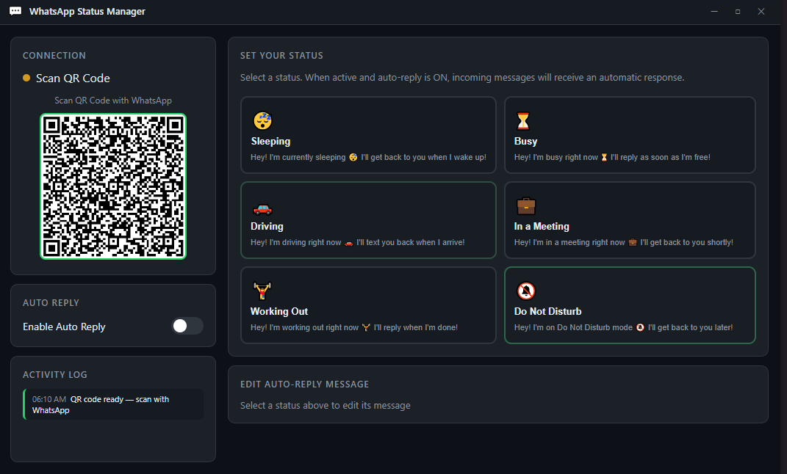

# 💬 WhatsApp Status Manager

A sleek Windows desktop app that automatically replies to your WhatsApp messages based on your current status — sleeping, busy, driving, and more.

Built with **Electron** + **whatsapp-web.js**. Works with your **personal WhatsApp account**. No business account or API key needed.

---



---

## ✨ Features

- 🔐 **Personal WhatsApp login** via QR code scan (just like WhatsApp Web)
- 😴 **6 built-in statuses** — Sleeping, Busy, Driving, In a Meeting, Working Out, Do Not Disturb
- ✏️ **Editable messages** — customize the auto-reply text for each status
- 🔔 **Auto-reply toggle** — enable/disable with one click
- 📋 **Activity log** — see every auto-reply sent in real time
- ⏱️ **Cooldown system** — won't spam the same person (1 min cooldown per contact)
- 🚫 **Group chats excluded** — only replies to individual DMs
- 💾 **Session saved** — scan QR once, stays logged in
- 📦 **Packaged as .exe** — no terminal needed after install

---

## 📸 Preview

| QR Login | Connected & Active |
|----------|-------------------|
| App shows QR code on launch | Select a status, toggle auto-reply ON |

---

## 🚀 Getting Started

### Option A — Download the EXE (easiest)

1. Go to the [Releases](https://github.com/NullVampx0/whatsapp-status-manager/releases) page
2. Download `WhatsApp Status Manager 1.0.0.exe` (portable, no install needed)
3. Double-click and run

> Windows may show a "Unknown publisher" warning — click **More info → Run anyway**. This is normal for unsigned apps.

---

### Option B — Run from Source

#### Prerequisites

- [Node.js](https://nodejs.org) v18 or higher
- [Git](https://git-scm.com)

#### Steps

**1. Clone the repository**
```bash
git clone https://github.com/NullVampx0/whatsapp-status-manager.git
cd whatsapp-status-manager
```

**2. Install dependencies**
```bash
npm install
```
> This will take a few minutes — it downloads Electron and Puppeteer (headless Chrome used by whatsapp-web.js)

**3. Start the app**
```bash
npm start
```

---

## 📱 How to Connect Your WhatsApp

1. Open the app — you'll see a QR code on the left panel
2. On your phone, open **WhatsApp**
3. Go to **Settings → Linked Devices → Link a Device**
4. Scan the QR code shown in the app
5. Wait a few seconds — the app will show **Connected** with your name and number

> Your session is saved locally. You only need to scan once unless you log out.

---

## 🎮 How to Use

**Step 1 — Select a status**

Click any of the 6 status buttons on the right panel:
- 😴 Sleeping
- ⏳ Busy  
- 🚗 Driving
- 💼 In a Meeting
- 🏋️ Working Out
- 🔕 Do Not Disturb

The selected status will highlight with a green border and show an **ACTIVE** badge.

**Step 2 — Enable Auto Reply**

Flip the **Enable Auto Reply** toggle on the left panel to ON (green).

**Step 3 — Done**

Anyone who DMs you on WhatsApp will now receive an automatic reply matching your status message. The Activity Log shows every reply sent.

**To stop auto-reply:**
- Toggle off Auto Reply, or
- Click the active status again to deactivate it

---

## ✏️ Editing Auto-Reply Messages

1. Click any status button
2. The **Edit Auto-Reply Message** section at the bottom right will show the current message
3. Edit the text
4. Click **Save Message**

Messages are saved locally and persist between app restarts.

---

## 🔨 Build EXE from Source

```bash
npm run build
```

Output goes to the `dist/` folder:
- `WhatsApp Status Manager Setup 1.0.0.exe` — installer with desktop shortcut
- `WhatsApp Status Manager 1.0.0.exe` — portable, no install needed

---

## ⚙️ Tech Stack

| Technology | Purpose |
|-----------|---------|
| [Electron](https://electronjs.org) | Desktop app framework |
| [whatsapp-web.js](https://wwebjs.dev) | WhatsApp Web automation |
| [Puppeteer](https://pptr.dev) | Headless browser (used by whatsapp-web.js) |
| [qrcode](https://www.npmjs.com/package/qrcode) | QR code image generation |
| Vanilla JS / HTML / CSS | UI — no frameworks |

---

## 🛠️ Troubleshooting

**QR code not appearing**
> Wait 20–30 seconds after launch. Puppeteer needs time to start the headless browser on first run.

**Session expired / QR keeps showing after restart**
> Delete the `wa-session` folder in the project directory (or `%APPDATA%\whatsapp-status-manager\wa-session` if using the installed version) and restart the app to re-scan.

**Auto-reply not sending**
> Make sure both a status is selected (green border) AND the Auto Reply toggle is ON. Check the Activity Log for any entries.

**App won't start**
> Make sure Node.js v18+ is installed. Run `node --version` in terminal to verify.

**Windows Defender warning on .exe**
> Click "More info" → "Run anyway". This happens because the exe isn't code-signed with a paid certificate.

---

## ⚠️ Disclaimer

This app uses [whatsapp-web.js](https://wwebjs.dev) which automates WhatsApp Web. It is intended for **personal use only**. Use responsibly — excessive automated messaging may violate WhatsApp's Terms of Service.

---

## 📄 License

MIT — free to use, modify, and distribute.

---

Made with ❤️ by [NullVampx0](https://github.com/NullVampx0)
